# ENGLINK
ENGLINK is custom designed low cost car engine scanner that interfaces directly with a car's Engine Control Unit via the CAN protocol, the device will plug into the car's OBD port, read real time parameters like Engine RPM, Coolant Temperature, and Vehicle Speed, and display them on a 1.3-inch on board oled display.

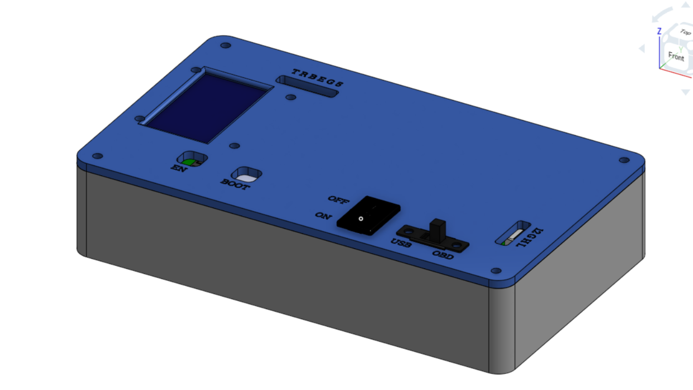
*Figure: The final 3D rendered vision of the ENGLINK pocket scanner.*

---

## 🎯 Purpose
The primary purpose of ENGLINK is to explore automotive communication networks, specifically the CAN (Controller Area Network) protocol by designing a custom hardware interface from scratch, my goal was to interact directly with a vehicle's Engine Control Unit (ECU) in real world conditions. The ultimate vision for this project is to engineer a clean, pocket sized tool that provides instant, critical engine stats on the go.

---

## 🛠️ Hardware & PCB Design
This PCB was designed in Altium Designer.

### Schematics

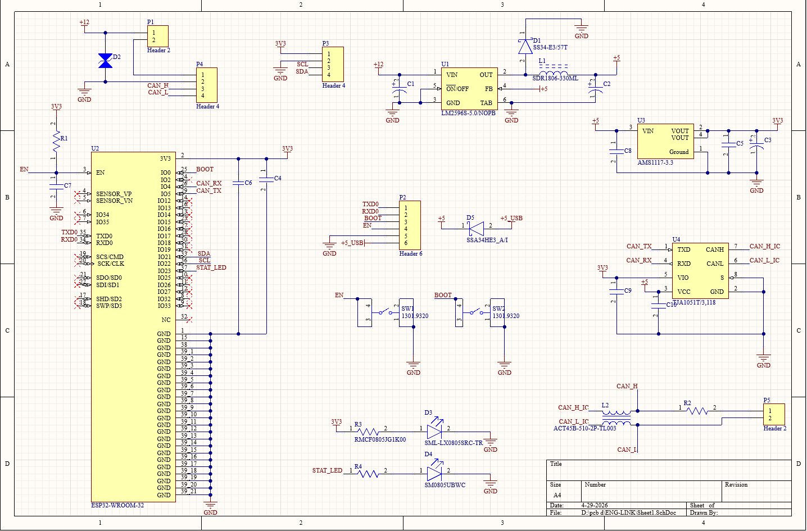
*Complete circuit design.*

### PCB Layout

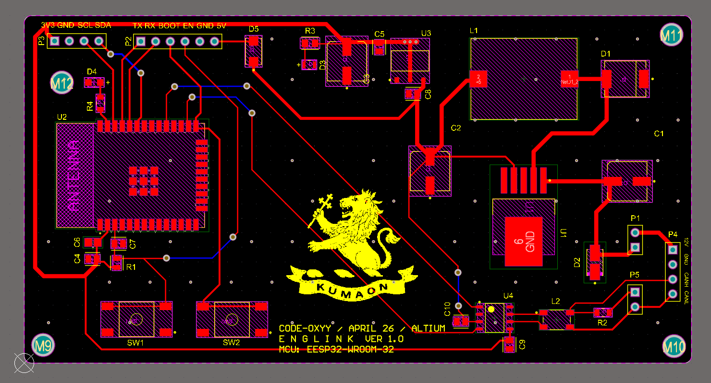
*PCB Layout.*

### PCB 3D View
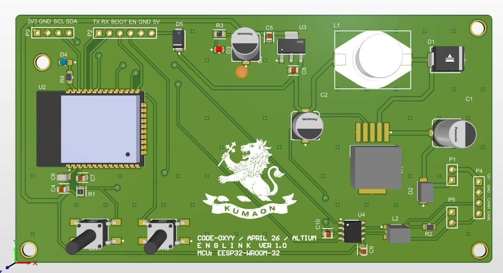
*Altium's 3D visualization of the board.*

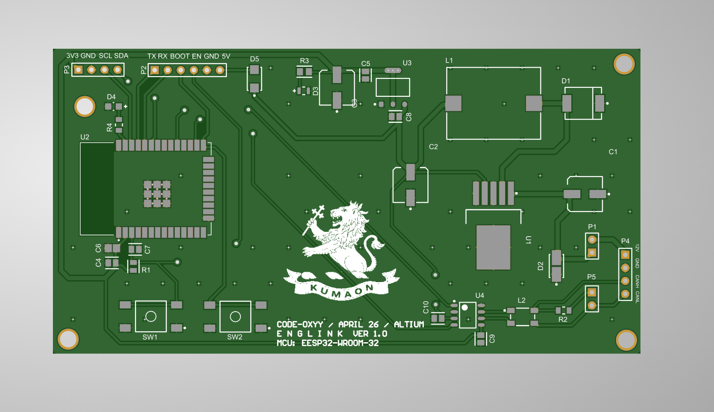
*Final Gerber view.*

---

## 📦 Mechanical Design (Enclosure)
The custom enclosure was modeled in **Onshape** and is split into 2 main 3D printable parts.
🔗 **[View 3D Model on Onshape](https://cad.onshape.com/documents/fb16a13bf66195b204bddbb0/w/9e57cceb297baca0e2841830/e/1cae4563a1118500ba7b1aec)**

### Top Lid
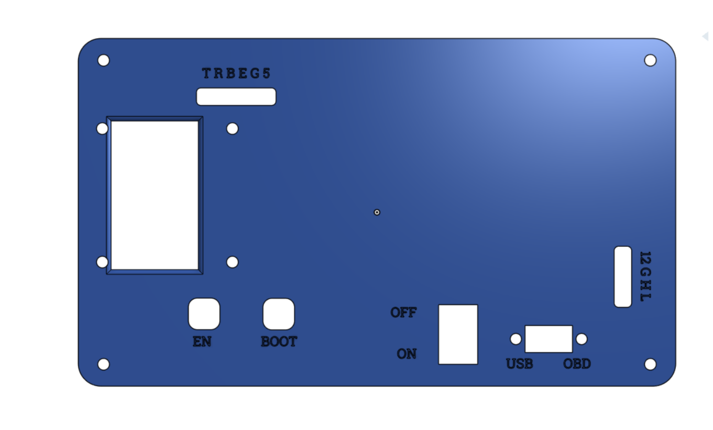
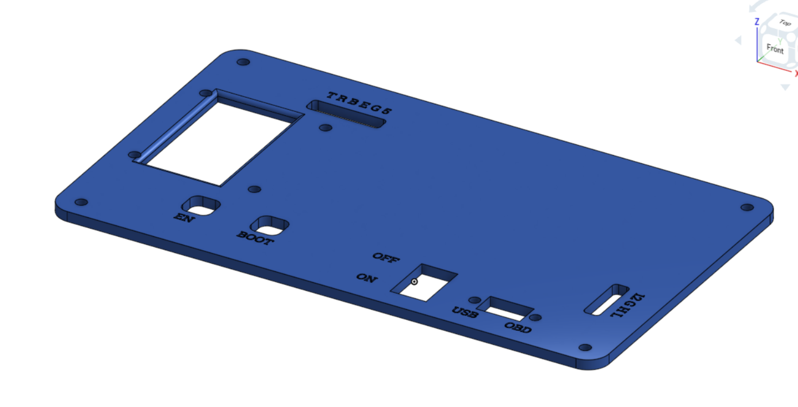
*Top cover featuring precise cutouts for the 1.3" OLED, control switches, and neatly engraved pin labels.*

### Base
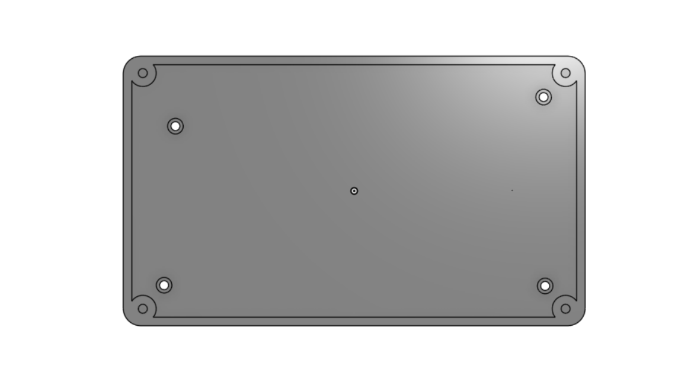
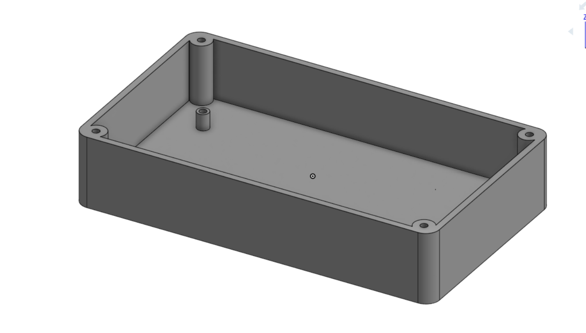
*Sturdy bottom base designed with mounting standoffs to securely hold the PCB in place.*

### Assembly
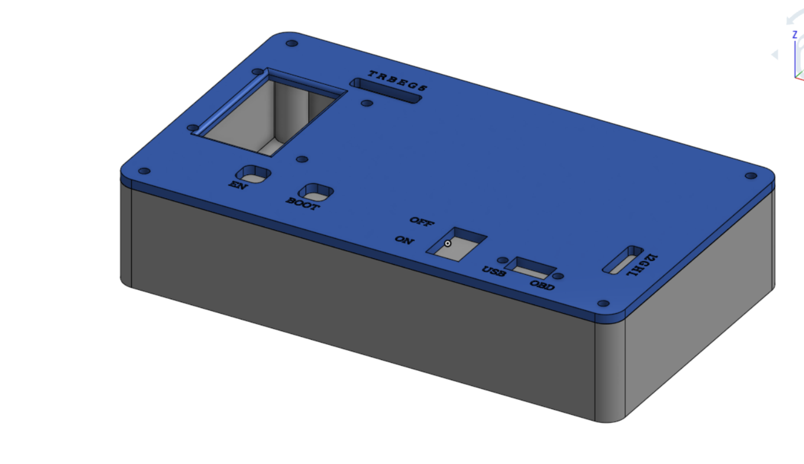
*CAD view showing how the top lid and bottom base sandwich together.*

### Fully Assembled ENGLINK
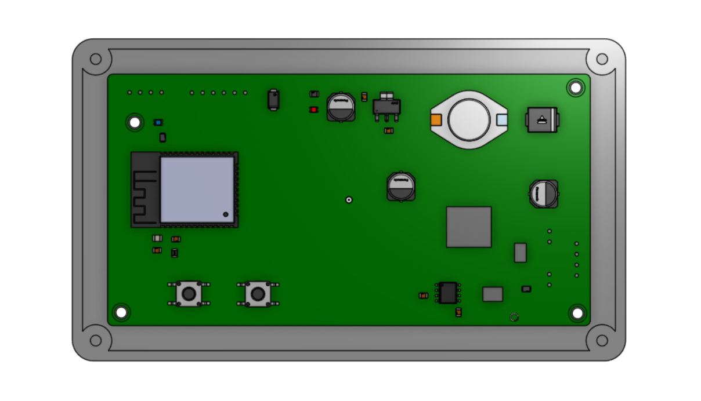
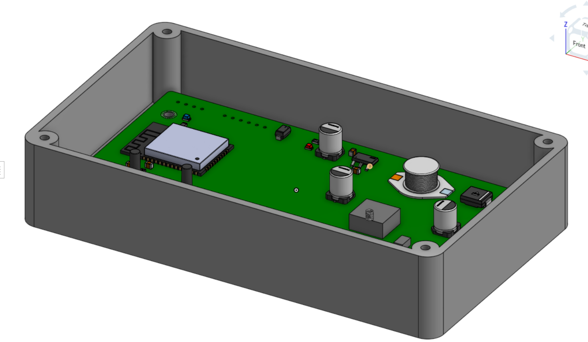
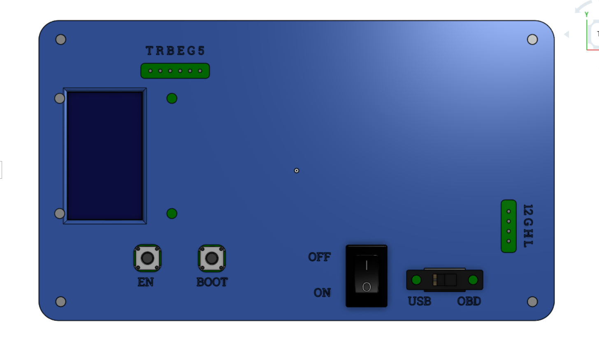

*CAD view showing how the top lid and bottom base sandwich together.*

---

## ✨ Features
* **Brain:** ESP32 WROOM 32
* **Face:** 1.3" OLED Display 
* **Communication:** On board CAN Transceiver interacting with the ESP32's native TWAI controller
* **Controls:** * KCD11 Rocker Switch for Main Power
  * SS12F15 Slide Switch for 120-ohm CAN Bus Termination
  * Tactile Push Buttons for EN & BOOT (Programming)
* **Firmware:** C/C++

---

## 🛒 Bill of Materials (BOM)

| Item / Part | Designator | Description / Purpose | Qty | Price | Source |
| :--- | :--- | :--- | :--- | :--- | :--- |
| ESP32-WROOM-32E | U2 | Main microcontroller  | 1 | ~$4.3 | [Electronicscomp](https://www.electronicscomp.com/espressif-esp32-wroom-32-4m-32mbit-flash-wifi-bluetooth-module) |
| 1.3" OLED Display (I2C) | - | I2C display for data viewing | 1 | ~$3.80 | [Electronicscomp](https://www.electronicscomp.com/1.3-inch-128x64-oled-display-screen-module-with-spi-serial-interface-v2?search=1.3%20oled%20display) |
| CAN Transceiver IC TJA1051T/3/1J | U4 | CAN Bus communication| 1 | ~1.70 | [Lioncircuits](https://www.lioncircuits.com/parts/TJA1051T%2F3%2F1J)|
| LM2596S-5.0 | U1 | 12V to 5V | 1 | ~$1.90 | [Robu](https://robu.in/product/lm2596s-5-0-nopb-texas-instruments-dc-dc-switching-regulator-buck-4-5v-to-40v-in-5v-out-3a-out-to-263-5?gad_campaignid=17427802703) |
| AMS1117-3.3 | U3 | 5V to 3V3 | 1 | ~$0.20 | [Robu](https://robu.in/product/ams1117-3-3-kexin-1a-fixed-3-3v-positive-electrode-18v-sot-223-4-voltage-regulators-linear-low-drop-out-ldo-regulators-rohs) |
| Bourns SDR1806 | L1 | Power Inductor | 1 | ~$0.50 | [Robu](https://robu.in/product/sdr1806-330ml-bourns-sdr1806-330ml-power-inductor-smd-33-%C2%B5h-3-a-unshielded-5-4-a-sdr1806-series) |
| SS34 SMC Diode | D1,D5 | 3A 40V Schottky Diode SMD SMC | 2 | ~$1.8 | [Lioncircuits](https://www.lioncircuits.com/parts/SS34-E3%2F57T) |
| SMAJ15CA | D2 | ESD Protection Diodes  |1 | ~$.6 | [Lioncircuits](https://www.lioncircuits.com/parts/SMAJ15CA) |
| 0805 Surface Mount LED Red | D3 | LED Red | 1 | ~$.1 | [Robu](https://robu.in/product/0805-surface-mount-led-red-50-pcs) |
| 0805 Surface Mount LED Blue | D4 |  LED Blue | 1 | ~$.1 | [Robu](https://robu.in/product/0805-surface-mount-led-blue-50-pcs) |
| 120 Ohm SMD Resistor 0805 | R2, R4 | Thick Film 0805 120 Ohm | 2 | ~$.1 | [Robu](https://robu.in/product/rc0805fr-07120rl-yageo-res-thick-film-0805-120-ohm-1-0-125w1-8w-%C2%B1100ppm-c-pad-smd-t-r?gad_campaignid=17427802703) |
| 1k Ohm SMD Resistor 0805 | R3 | Thick Film 0805 1k Ohm | 1 | ~$.1 | [Robu](https://robu.in/product/1k-ohm-1-4w-0805-surface-mount-chip-resistor-pack-of-10) |
| 10k Ohm SMD Resistor 0805 | R1 | Thick Film 0805 10k Ohm | 1 | ~$.1 | [Robu](https://robu.in/product/10k-ohm-1-8w-805-resistorreel-of-5000) |
| CL21B106KOQNFNE | C4 C5 C7 C8 C9 C10 | Samsung-Cap Ceramic 10uF 16V | 6 | ~$.1 | [Robu](https://robu.in/product/cl21b106koqnfne-samsung-cap-ceramic-10uf-16v-x7r-10-pad-smd-0805-125c-t-r) |
| 100nF 0805 SMD Capacitor | C6 | 100nF 0805 Surface Mount Multilayer Ceramic Capacitor | 1 | ~$.1 | [Robu](https://robu.in/product/100nf-0805-surface-mount-multilayer-ceramic-capacitor-pack-of-40) |
| 100uF 35V SMD Electrolytic Capacitor | C1 C2 C3 | SMD ALUMINUM ELECTROLYTIC CAPACITOR TQ 35V | 3 | ~$5 | [Robu](https://www.lioncircuits.com/parts/EEE-TQV101XAP) |
| ACT45B-510-2P-TL003 | L2 | Common-Mode Choke (CMC)  | 1 | ~$2.5 | [Lioncircuits](https://www.lioncircuits.com/parts/ACT45B-510-2P-TL003) |
| KCD11 Rocker Switch | - | Main Power control | 1 | ~$0.8 | [Rlectronicscomp](https://www.electronicscomp.com/mini-rocker-switch-6a-250v-2pin-5pcs) |
| SS12F15 Slide Switch | - | 120-ohm CAN Bus Termination | 1 | ~$0.3 | [Robu](https://robu.in/product/1-month-warranty-254) |
| Tactile Push Buttons | SW1, SW2 | EN & BOOT / Programming buttons | 1 | ~$0.30 | [Robu](https://robu.in/product/6x6x8mm-tactile-push-button-switch-pack-of-20) |
| OBD-II to Header Cable | - | Connects vehicle's OBD port to the device | 1 | ~$7.00 | [Amazon](https://www.amazon.in/Star-AutoLink-Extension-Diagnostic-STAR043/dp/B0FN4DJHJT?source=ps-sl-shoppingads-lpcontext&ref_=fplfs&psc=1&smid=A2KYYA926JU3GF) |
| Custom PCB  | PCB | Main fabricated circuit board | 1 | $ 17 | [Robu](https://robu.in) |
| 3D Printed Enclosure | CASE | Top Lid & Base for housing electronics | 1 Set| - | [Printing Legion](#) |
| M3 Screws | - | For securely mounting PCB and Enclosure | 2 | ~$1.00 | [Electronicscomp](https://www.electronicscomp.com/m3-x-15mm-chhd-bolt-and-nut-set-10-pieces-pack) |
| 4 Pin 2510 Connector Kit | P4 | JST XH 2.54mm Pitch Wire-to-Board Connectors with Male & Female | 1 | $ 1.5 | [Amazon](https://www.amazon.in/Pin-2510-Connector-Wire-Board/dp/B0DXD35PCT) |
| 4 Pin Connector Kit | P3 | 4 Pin JST XH Relimate Connector (RMC) Male-Female Pair With Wire/Cable | 1 | $ .2 | [Electronicscomp](https://www.electronicscomp.com/power-supply/battery/battery-harness/4-pin-polarized-header-wire) |
| 2 Pin Connector Kit | P1 P5 | 2 Pin JST XH Relimate Connector (RMC) Male-Female Pair With Wire/Cable | 2 | $ .2 | [Electronicscomp](https://www.electronicscomp.com/2-pin-polarized-header-wire) |
| 6 Pin Connector Kit | P2 | 6 Pin JST XH Relimate Connector (RMC) Male-Female Pair With Wire/Cable | 1 | $ .2 | [Electronicscomp](https://www.electronicscomp.com/power-supply/battery/battery-harness/6-pin-polarized-header-wire) |
| FT232RL  | - | USB to TTL Serial Adapter Module | 1 | $ 1.3 | [Electronicscomp](https://www.electronicscomp.com/ft232rl-usb-ttl-serial-adaptor-module-for-arduino) |
| FLUX soldering paste  | - | Noel FLUX soldering paste | 1 | $ .5 | [Robu](https://robu.in/product/noel-flux-soldering-paste-10g) |
| Solder Wire  | - | Solder Wire 50g | 1 | $3 | [Knowledgeelectronics](https://knowledgeelectronics.com/product/solder-wire-50gm-60-40/) |

TOTAL ~ $56 

---

## 📄 License
This project is open-source and available under the **MIT License**
